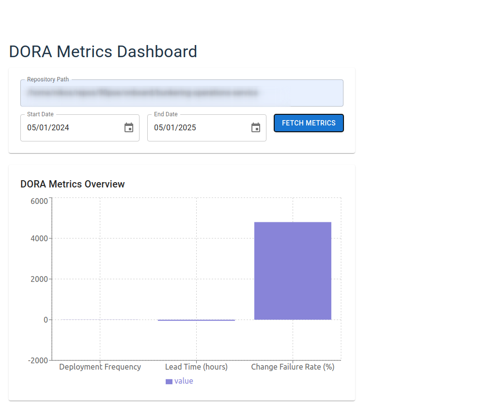

# Godora - DORA Metrics Analyzer



A tool that analyzes git log to extract some DORA metrics (Deployment Frequency, Lead Time for Changes, and Change Failure Rate) assuming some convention in the commit message.

## Features

- Extracts DORA metrics from git repository history
- Visualizes metrics in a modern web interface
- Supports custom date ranges
- Docker support for easy deployment
- Configure git repository path directly from the UI

## Prerequisites

- Go 1.21 or later
- Node.js 20 or later
- Docker and Docker Compose (optional)

## Development Setup

### Local Development

1. Backend:
```bash
cd backend
go mod download
go run cmd/api/main.go
```

2. Frontend:
```bash
cd frontend
npm install
npm run dev
```

### Docker Development

```bash
docker-compose up
```

The application will be available at:
- Frontend: http://localhost:5173
- Backend: http://localhost:8099

## Commits Naming Convention

The tool uses commit names to identify different types of changes:

- Deployments: Commit names containing "deploy"
- Features/Tasks: Commit names containing "feat" or "task"
- Bug Fixes: Commit names containing "fix"

## Building for Production

```bash
docker build -t godora .
docker run -p 8099:8099 godora
```

## License

MIT 